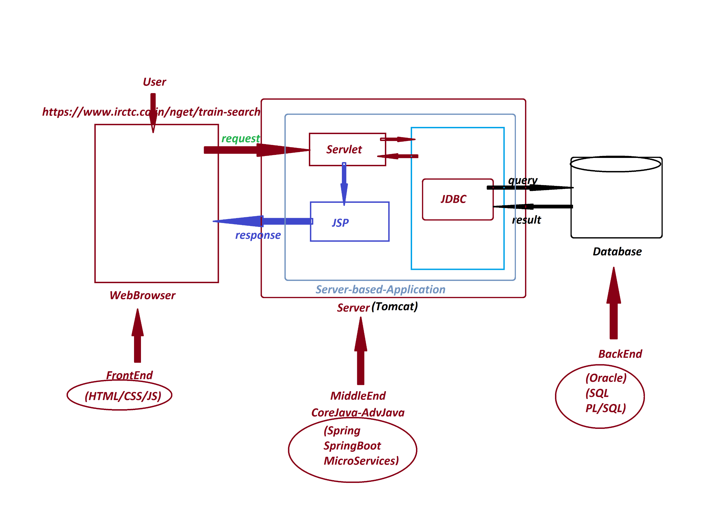
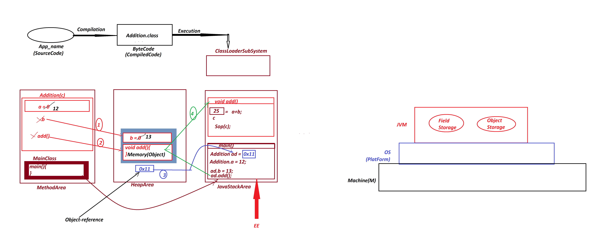

# Advance Java Notes  

## Index  
1. [Summary of Core Java](#summary-of-core-java)  
   - [Java Programming Components (Java Alphabets)](#java-programming-components-java-alphabets)  
   - [Java Programming Concepts](#java-programming-concepts)  
   - [Object-Oriented Programming Features](#object-oriented-programming-features)  
2. [Stand-Alone Application](#stand-alone-application)  
3. [FAQ: Server-Based Applications](#faq-server-based-applications)  
   - [Web Applications](#web-applications)  
   - [Enterprise Applications](#enterprise-applications)  
4. [JDBC (Part-1)](#jdbc-part-1)  
5. [FAQ: Storage and Types of Storage](#faq-storage-and-types-of-storage)  
   - [Field Storage](#field-storage)  
   - [Object Storage](#object-storage)  
6. [Example: Object and Object Reference](#example-object-and-object-reference)  
7. [FAQ: Difference Between](#faq-difference-between)  
   - [Object](#i-object)  
   - [Object Reference](#ii-object-reference)  
   - [Object Reference Variable](#iii-object-reference-variable)  
8. [Important: List of Objects Generated from Core Java](#important-list-of-objects-generated-from-core-java)  
9. [Note: Field and Object Storage in JVM](#note-field-and-object-storage-in-jvm)  
---

## Summary of Core Java  

### Java Programming Components (Java Alphabets)  
- **Variables**  
- **Methods**  
- **Constructors**  
- **Blocks**  
- **Class**  
- **Interface**  
- **Abstract Class**  

### Java Programming Concepts  
- **Object-Oriented Programming**  
- **Exception Handling Process**  
- **Java Collection Framework**  
- **Multi-Threading Concept**  
- **File Storage in Java**  
- **Networking in Java**  

### Object-Oriented Programming Features  
- **Class**  
- **Object**  
- **Abstraction**  
- **Encapsulation**  
- **Polymorphism**  
- **Inheritance**  

---

## Stand-Alone Application  
**Definition:**  
A **Stand-Alone Application** (also known as a **Non-Server Application**) is an application that is installed and executed on a single computer, performing actions only on that computer.  

---

## FAQ: Server-Based Applications  

### Definition  
Server-based applications are applications that run in a **server environment**. These applications are categorized into:  
1. **Web Applications**  
2. **Enterprise Applications**  

### Web Applications  
- Constructed using **Advanced Java technologies** like **JDBC, Servlets, and JSP**.  
- Typically follow a **3-tier architecture**.  
- 

### Enterprise Applications  
- Executed in a **distributed environment**.  
- Depend on features like **Security, Load Balancing, and Clustering**.  
- Follow an **n-tier architecture**.  
- **Examples:** Java Frameworks, Java Tools.  

---

## JDBC (Part-1)  
**Definition:**  
JDBC stands for **Java Database Connectivity** and is used to interact with a database.  

---

## FAQ: Storage and Types of Storage  

### Definition of Storage  
A **storage** is a memory location where data is available for access.  

### Types of Storage in Java  
Java applications categorize storage into four types:  
1. **Field Storage**  
   - Memory allocated for holding a **single** data value.  
   - Created when using **primitive data types** (`byte`, `short`, `int`, `long`, `float`, `double`, `char`, `boolean`).  

2. **Object Storage**  
   - Memory allocated to store **grouped values**.  
   - Created when using **non-primitive data types** (`Class`, `Interface`, `Array`, `Enum`).  

---
## Example: Object and Object Reference  

```java
class Addition {
    static int a;
    int b;

    void add() {
        int c = a + b;
        System.out.println(c);
    }
}

Addition ad = new Addition();
ad.a = 12;
ad.b = 13;
ad.add();

Addition ob2 = ad;
```

- 

---

## FAQ: Difference Between  

### (i) Object  
- The **memory generated** to hold **instance members** of a class is known as an **Object**.  

### (ii) Object Reference  
- The **address location** where the object is created is known as the **Object Reference**.  

### (iii) Object Reference Variable  
- A **non-primitive data type variable** that holds an **object reference** is known as an **Object Reference Variable** (or Object Name).  

---

## Important: List of Objects Generated from Core Java  

1. **User-Defined Class Objects**  
2. **String Objects**  
3. **Wrapper Class Objects**  
4. **Array Objects**  
5. **Collection<E> Objects**  
6. **Map<K,V> Objects**  
7. **Enum<E> Objects**  

---

## Note: Field and Object Storage in JVM  

- **Field and Object Storage** generated as part of the **JVM during application execution** will be **automatically destroyed** when the JVM **shuts down**.  
- If **permanent storage** is required for an application, it must use one of the following:  
  - **File Storage**  
  - **Database Storage**  

---
